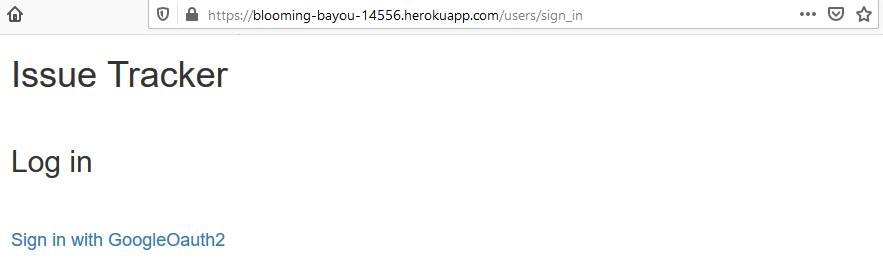

# IssueTracker G13D 
Web made with [Ruby On Rails](https://rubyonrails.org/), based on Bitbucket's Issue Tracker.

## Screenshots
These are some screenshots of the web.

### Login Page

### Home Page
It has its filters as it can be seen in second picture.

### Create an Issue

### Issue Detail
Issue details page where it can be seen the comments of it and its status, priority, votes and all its properties.

.png)

## Authors
- Danci, Marian Dumitru
- Ait Fonollà, Adem
- Segura Sánchez, Enric
- Conesa Gago, Agustí

Link heroku:
https://blooming-bayou-14556.herokuapp.com
